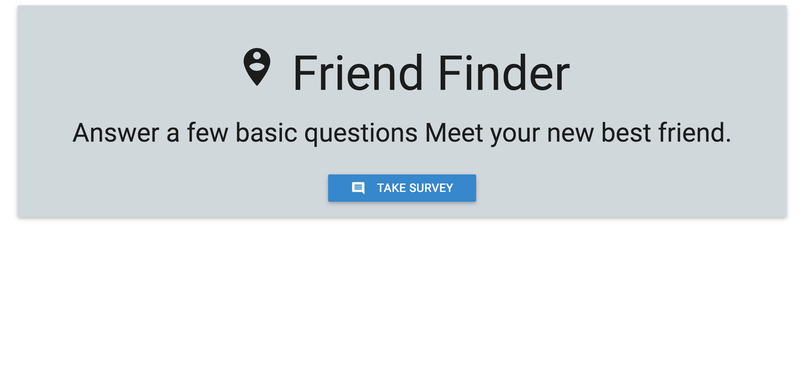
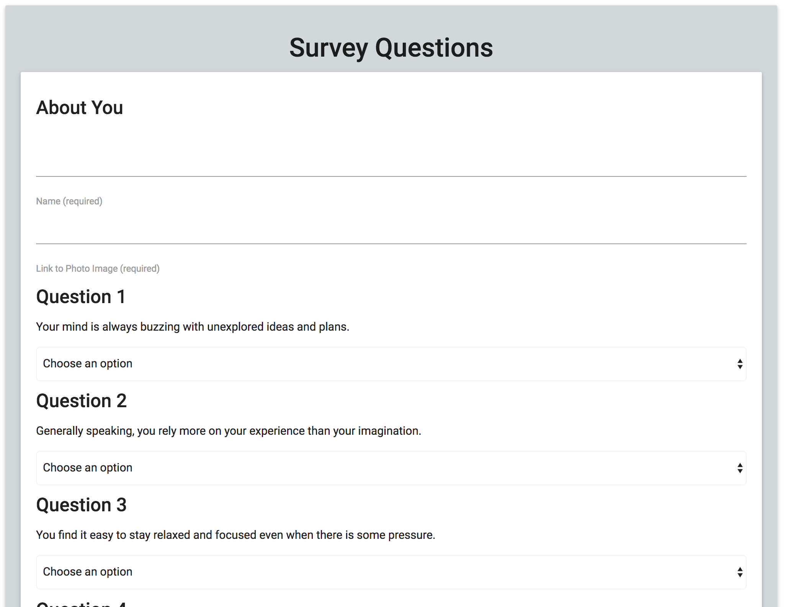

# FriendFinder
This app is like the quiz websites that we all seem to visit. It uses Node and Express Servers. It has home page and a survey page. When the use answer the survey, they are matched with a "friend" that is their best match from the survey.

## Getting Started
https://toneykfriendfinder.herokuapp.com/

## Screen Shots


Index Page


Survey

## Technologies used
- Node.js
- body-parager NPM Package - https://www.npmjs.com/package/inquirer
- express NPM Package - https://www.npmjs.com/package/express
- path NPM Package - https://www.npmjs.com/package/path

### Prerequisites

```
- Node.js - Download the latest version of Node https://nodejs.org/en/
- Materialize - Add CDN link to HTML http://materializecss.com/getting-started.html
```

## Built With

* Visual Studio Code - Text Editor
* Materialize - Wireframe

## Authors

* **Toney K** - *HTML/JS/Node.js* - [Toney K](https://github.com/ToneyK)